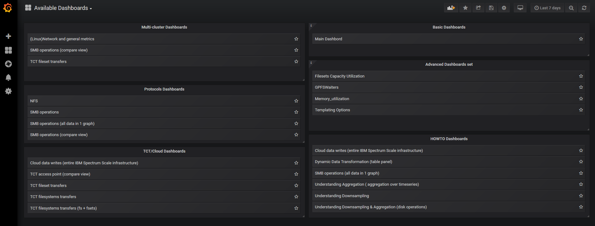

### Importing dashboards from Example Dashboards bundle

With the bridge version 4, the new collection of example dashboards (["Example Dashboards bundle"](example_dashboards_bundle.zip)) has been added to the available for free download resources. These new dashboards could be used for managing a multi-cluster environment. Also the ["default dashboards set"](default dashboards set.zip) and  ["Advanced Dashboards set"](Advanced dashboard set.zip)  have been merged into this download package.

The package content consists of several folders:

- Predefined Basic Dashboards - including all dashboard examples from ["default dashboards set"](default dashboards set.zip) package
- Advanced Dashboards -  including all dashboard examples from ["Advanced Dashboards set"](Advanced dashboard set.zip) package
- HOWTO - including dashboard examples with learning effect, f.e. Grafana's helpful features
- NamedQueries - including dashboard examples for monitoring Linux(Network) metrics
- Protocols - including dashboard examples for monitoring SMB and NFS metrics
- TCT - including dashboard examples for monitoring TCT/cloud data transfers

You can create the same folder structure in your running Grafana environment and sort the imported dashboards into it, but this is not a mandatory step.

Each dashboard, included in the download package, can be imported and used as stand-alone dashboard, independent from all other dashboards in the package.  Only the "Available Dashboards" and the "Main Dashboard" are linked with children dashboards and do represent an example of the dashboards structuring.

If you want to make a usage of the dashboards list overview as shown in the screenshot below, it is recommended to set the Grafana's home dashboard to the "Available Dashboards". For more information about how to change the home dashboard settings in Grafana read [this](https://community.grafana.com/t/change-home-dashboard/7441) Grafana's Community post.

